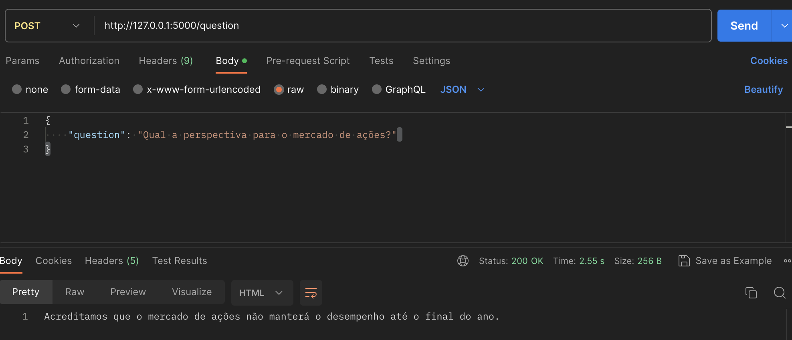

<p align="center">
<a href= "https://www.inteli.edu.br/"></a>
</p>

<br>

# Automação com reconhecimento por voz

Nome do Projeto: Automação com reconhecimento por voz

Nome do Parceiro: IBM

Nome do Grupo: The Whispers

Integrantes do grupo:

- <a href="https://www.linkedin.com/in/jordan-andrade-352541240/">Jordan Andrade Custodio da Silva</a>
- <a href="https://www.linkedin.com/in/l%C3%ADvia-bonotto-9064641a3/">Lívia Mattoso Bonotto Cabral</a>
- <a href="https://www.linkedin.com/in/marcos-florencio-n/">Marcos Florêncio </a>
- <a href="https://www.linkedin.com/in/mariana-silva-paula/">Mariana Silva de Paula</a>
- <a href="https://www.linkedin.com/in/pedro-gattai-096678227/">Pedro Gattai </a>
- <a href="https://www.linkedin.com/in/victor-severiano-de-carvalho-b57a05237/"> Victor Severiano de Carvalho</a>

**Conteúdo**

- [Visão Geral do Projeto](#visão-geral-do-projeto)
- [Entendimento do Negócio](#entendimento-do-neg%C3%B3cio-sprint-1)
- [Entendimento do Design](#entendimento-do-design-sprint-1)
- [Entendimento da Arquitetura do Sistema](#entendimento-do-design-sprint-1)
- [Documentação da Construção do Backend da Solução](#documentação-da-construção-do-backend-da-solução-sprint-3)
- [Documentação da Construção do Frontend da Solução](#documentação-da-construção-do-frontend-da-solução-sprint-4)
- [Documentação Final do Projeto](#documentação-final-do-projeto-sprint-5)
- [Referências](#referências)
- [Apêndice](#apêndice)

# Visão Geral do Projeto

## Parceiro de Negócios


A IBM (International Business Machines Corporation) é uma das maiores e mais antigas empresas de tecnologia do mundo. Fundada em 1911, possui uma longa história de inovação e contribuições para o setor de tecnologia. A IBM é uma empresa de grande porte, com operações globais abrangendo uma ampla gama de setores e mercados.

A empresa atua principalmente no setor de tecnologia da informação, oferecendo uma variedade de produtos e serviços, incluindo hardware, software, serviços de consultoria e serviços em nuvem. A IBM é conhecida por sua expertise em áreas como inteligência artificial, computação em nuvem, análise de dados, segurança cibernética e sistemas empresariais.

## Problema

Um desafio significativo que a IBM enfrenta reside na habilidade de acompanhar e compreender as discussões em curso no meio empresarial, a fim de manter sua competitividade no atual cenário altamente dinâmico. O processo contínuo de buscar informações pertinentes e identificar oportunidades de negócios tornou-se uma demanda constante, principalmente para as equipes de vendas e marketing, que estão sempre em movimento.

## Objetivos

O principal objetivo da solução é fornecer um meio conveniente e eficaz para a equipe de vendas e marketing se manterem atualizadas e preparadas para abordarem as necessidades dos clientes. A interação por voz torna o processo mais acessível e ágil, especialmente para profissionais que estão frequentemente em trânsito. Além disso, a integração com dispositivos de hardware conectados em diferentes ambientes potencializa o alcance e a versatilidade da solução.

Em resumo, a solução de busca por voz para acompanhamento empresarial e atualização de vendas e marketing representa um passo à frente na maneira como as informações são acessadas e aplicadas no mundo corporativo. Ao alavancar a conveniência da interação por voz e a integração com diversos dispositivos, essa solução promete melhorar a agilidade, a eficiência e a competitividade das equipes, proporcionando insights atualizados em tempo real e auxiliando na identificação de oportunidades estratégicas.

## Partes Interessadas

Descrever os principais stakeholders envolvidos no projeto e seus papéis.

* **International Business Machines Corporation (IBM):** Empresa parceira responsável pela abordagem do problema. Possui como principal interesse obter uma ferramenta de pesquisa por voz capaz de auxiliar os funcionários da IBM a realizar consultas de mercado de maneira simplificada e rápida, melhorando assim a eficiência dos colaborados da empresa por meio do do ganho de tempo decorrente da otimização dessas pesquisas. Cabe à essa parte fornecer suporte por meio de materiais e documentos que explicitem os problemas, as necessidades e as expectativas da interessada com o projeto. Além disso, espera-se a que a IBM possa acompanhar o desenvolvimento das atividades por meio de conversas de alinhamento com o professor orientador (Reginaldo Arakaki) e por meio de feedbacks dado ao time de desenvolvimento durante as entregas de cada sprint.
  
* **Instituto de Tecnologia e Liderança (INTELI):** Instituição  responsável por mediar, conectar e auxiliar as demais partes interessadas no projeto. Seu principal interesse é criar boas relações com empresas parceiras nos projetos de ensino oferecidos pela faculdade e garantir aos alunos participantes desse projeto utilizar dessa colaboração para aprender os conceitos, as boas práticas e as ferramentas mais utilizadas no mercado. Espera-se que a instituição, representada pelo professor orientador (Reginaldo Arakaki), possa mediar o diálogo entre o time de desenvolvimento e a empresa parceira de modo que relação entre ambos possa resultar na entrega de um produto funcional e que atenda aos objetivos propostos neste documento. Além disso, também espera-se que o INTELI possa dar suporte ao time de desenvolvimento no que  se refere à materiais didáticos, programas, assinaturas, ferramentas e mentorias necessárias para a plena conclusão do projeto.

* **Alunos responsáveis pelo projeto ( Time de Desenvolvimento):** Parte responsável por desenvolver a solução do problema proposto pela equipe parceira. Seu principal interesse é utilizar do projeto e dos materiais e ferramentas fornecidos pela faculdade para aprender e praticar os conteúdos relacionados ao Processamento de Linguagem Natural (NLP) e conversão de áudio para texto (Speech to Text), além de ter a oportunidade de coletar a experiência em trabalhar em um projeto real com uma empresa parceira. Espera-se que o time possa agir de maneira colaborativa com as demais partes interessadas de modo entregar um MVP que satisfaça com excelência os objetivos acordados neste documento.


# Requisitos

Esta seção é importante porque permite que os desenvolvedores entendam claramente o que é esperado do software e quais serão as restrições e desafios enfrentados durante o desenvolvimento. Além disso, permite que os usuários finais saibam se o software atende às suas expectativas e se está adequado ao seu ambiente de trabalho.

A seção de requisitos do sistema é atualizada constantemente durante o ciclo de desenvolvimento do software, garantindo que todas as necessidades e especificações estejam sempre atualizadas.

## Requisitos funcionais

Esta seção da documentação do software fornece uma descrição detalhada dos requisitos do sistema. Ela inclui informações sobre as funcionalidades esperadas do software, as restrições e limitações do sistema e outras especificações relevantes.

| Código | Descrição do Requisito                                                                                                                   | Grupo         | Prioridade |
| ------ | ---------------------------------------------------------------------------------------------------------------------------------------- | ------------- | ---------- |
| RF1    | O sistema deve realizar o login do usuário                                                                                               | Segurança     | HIGH       |
| RF2    | O sistema deve permitir que o usuário faça uma pergunta                                                                                  | Funcionamento | HIGH       |
| RF3    | O sistema deve permitir que o usuário acesse um histórico de interações                                                                  | Funcionamento | MEDIUM     |
| RF4    | O sistema deve responder às perguntas específicas do usuário sobre assuntos                                                              | Funcionamento | HIGH       |
| RF5    | O sistema deve fornecer dados atualizados sobre o mercado com suas fontes                                                                | Eficiência    | MEDIUM     |
| RF6    | O sistema deve ser capaz de comparar as atividades da empresa com as da concorrência, oferecendo insights sobre oportunidades e desafios | Eficiência    | LOW        |

## Requisitos não funcionais

Descreve os recursos necessários para sua execução, os requisitos de segurança e privacidade.

| Código | Descrição do Requisito                                                                                                                                                                                                    | Grupo          | Prioridade |
| ------ | ------------------------------------------------------------------------------------------------------------------------------------------------------------------------------------------------------------------------- | -------------- | ---------- |
| RNF01  | O sistema deve ter uma interface gráfica com foco em mobile                                                                                                                                                               | Usabilidade    | MEDIUM     |
| RNF02  | O sistema deve ser capaz de rodar em diferentes plataformas com mínimas alterações                                                                                                                                        | Usabilidade    | LOW        |
| RNF03  | O sistema deve ser capaz de capturar o áudio enviado pelo usuário e transcrever para texto                                                                                                                                | Funcionamento  | HIGH       |
| RNF04  | O sistema deve se integrar com ferramentas de gestão de relacionamento de clientes (CRM), disponibilizado pela plataforma Kaggle e utilizado pela equipe de vendas, garantindo a sincronização de informações importantes | Funcionamento  | MEDIUM     |
| RNF05  | O sistema deve retornar a resposta de acordo com o público, com gráficos e dashboards focados para a equipe de vendas                                                                                                     | Funcionamento  | HIGH       |
| RNF06  | O sistema deve ser fluído e rápido, com tempo entre pergunta e resposta de no máximo 3 segundos                                                                                                                           | Eficiência     | LOW        |
| RNF07  | A transcrição da mensagem deve ter sucesso em pelo menos 95% das vezes                                                                                                                                                    | Eficiência     | MEDIUM     |
| RNF08  | O sistema deve suportar pelo menos 500 acessos simultâneos                                                                                                                                                                | Eficiência     | LOW        |
| RNF09  | O sistema deve pegar as referências dos sites que faz consulta, como data, meio de divulgação e links                                                                                                                     | Confiabilidade | HIGH       |
| RNF10  | O sistema deve utilizar fontes de informações concretas, como dados de vendas e análises de mercado, para fundamentar suas respostas para as perguntas do usuário                                                         | Confiabilidade | HIGH       |
| RNF11  | O sistema deve garantir a privacidade dos dados                                                                                                                                                                           | Segurança      | LOW        |
| RNF12  | O sistema deverá limitar o acesso apenas a funcionários da IBM                                                                                                                                                            | Segurança      | HIGH       |
| RNF13  | O sistema deve ter proteção contra acesso não autorizado                                                                                                                                                                  | Segurança      | MEDIUM     |
| RNF14  | O sistema deve ter um output que faça um resumo do conteúdo do diálogo para facilitar a interpretação do usuário                                                                                                          | Acessibilidade | HIGH       |

# Entendimento do Negócio

## Matriz de avaliação de valor Oceano Azul

A Matriz de avaliação de valor Ocenao azul é uma ferramenta de negócios utilizada para realizar uma abordagem estratégica de negócios para criar um novo espaço de mercado, ressaltando os pontos em que um modelo de negócios se diferencia e sobressai em relação aos seus concorrentes com base em atributos relevantes presentes em cada aplicação. Dessa forma, foi realizada uma Matriz Oceano Azul do projeto Nexus para compará-lo com as soluções oferecidas no mercado e agregar valor a solução com base em suas qualificações diferenciais. A matriz pode ser visualizada na tabela e imagem a seguir:

| Categoria | Atributos                     | Nexus | Google | ChatGPT |
| --------- | ----------------------------- | ----- | ------ | ------- |
| Eliminei  | Preço                         | 0     | 0      | 9       |
| Reduzi    | Qualidade                     | 7     | 9      | 8       |
| Reduzi    | Tecnologia                    | 6     | 8      | 10      |
| Aumentei  | Confiabilidade dos resultados | 10    | 6      | 4       |
| Aumentei  | Resultados Personalizados     | 10    | 4      | 7       |
| Reduzi    | Pesquisa e resposta por voz   | 9     | 10     | 0       |
| Aumentei  | Funcionalidades               | 10    | 3      | 6       |
| Reduzi    | Liberdade de acesso           | 3     | 10     | 7       |


- **Preço**: Nexus e Google são softwares gratuitos e por isso na categoria preço eles ficaram com a nota igual a 0. Já o chat GPT custa 20$ dólares mensalmente para sua versão completa, restando apenas uma versão demo com recursos restritos ao público geral, o que lhe concede uma nota 9 nesse quesito. O custo foi eliminado pois a aplicação será desenvolvida utilizando as tecnologias da própria empresa parceira e tecnologias de código aberto, além da erradicação do custo de mão de obra do time de desenvolvimento.

- **Qualidade**: Nexus será uma aplicação construída utilizando as tecnologias mais avançadas do mercado, como React, AWS e Ibm Watson, o que garante uma tecnologia de ponta e qualidade excepcional, digna de uma avaliação 7. Todavia, os concorrentes diretos da nossa aplicação, Google e Chat GPT, também são referências no desenvolvimento de tecnologias, sobretudo inteligência artificial e algoritmos de busca, o que atribui a à concorrência um “know how” e expertise quanto ao uso de tecnologias superior ao da nossa aplicação, garantindo maior qualidade e uma pontuação superior ao Nexus. A qualidade da aplicação foi reduzida devido à disponibilidade de tempo de entrega inferior a dos demais concorrentes e à limitação educacional do time de desenvolvimento.

- **Tecnologia**: Essa categoria representa as tecnologias usadas para desenvolver cada um. Considerando suas características, o ChatGPT recebeu uma nota 10 por dispor de uma tecnologia da qual revolucionou o mercado e continua revolucionando, o Google tem uma nota 8 por dispor de uma tecnologia relativamente simples, mas muito sofisticada comparado ao seus concorrentes e o nosso produto Nexus recebeu uma nota 6 pois ele dispõe de muitas tecnologias fornecidas por parceiros. A tecnologia foi reduzida pois o time de desenvolvimento conta com um prazo reduzido de entrega e limitação às ferramentas disponibilizadas e ensinadas pela instituição na qual fazem parte.

- **Confiabilidade nos resultados**: O ChatGPT recebeu a menor nota sendo ela igual à 4, pois ao realizarmos testes nele foi possível concluir que quando ele não sabe a resposta para algo, ele cria algo para fornecer uma resposta da qual na maioria das vezes é desconexo com o que foi perguntado. Já o Google ficou com uma nota 6 por conta de o resultado de suas pesquisas não serem tão assertivas, fazendo com que em uma grande parte das vezes se tenha que entrar em diversos links até encontrar o que deseja. Já o Nexus foi classificado com uma nota 10, por conta de fazer perguntas para o usuário para chegar o mais próximo possível do que ele deseja e responder quando tiver certeza de algo. Caso ele não tenha certeza, ele avisará o usuário e, caso ele não saiba também, impedirá que o usuário receba informações duvidosas, como também diminuirá o tempo gasto do usuário buscando algo que não está disponível na plataforma. A confiabilidade foi aumentado pois a aplicação terá um cuidado em analisar as saídas obtidas e entregar ao usuário somente dados confiáveis.
- **Resultados personalizados**: O Nexus recebeu a maior nota nessa categoria, que foi 10, por conter o resultado mais personalizado de acordo com quem está acessando.O Nexus também irá responder de forma diferente para seus dois usuários e oferecerá resultados personalizados a partir de seu histórico. O ChatGPT recebeu a segunda maior nota da qual foi 7, por conta de sua resposta personalizada só ocorrer após um certo número de interações com ele, não podendo direcioná-lo antes de começar uma interação. Já o Google foi o que obteve a menor nota, que foi 4, pois ele só direciona os resultados personalizados para anúncios dos quais aparecem relacionados às suas pesquisas, ele não obtém resultados personalizados para o que o usuário quer encontrar com suas pesquisas. Os resultados personalizados foram aumentados pois a aplicação contará com uma interface personalizada de acordo com o perfil do usuário, atributo pouco desenvolvido nas empresas concorrentes.

- **Pesquisa e resposta por voz**: O Nexus recebeu nesse quesito nota 8 pois irá contar com um sistema de pesquisa por voz que utiliza tecnologias de última geração como o IBM Watson Speech to Text, garantindo maior qualidade à essa funcionalidade. Em contrapartida, o Google recebeu uma avaliação nota 10 pois, além de contar com a tecnologia de pesquisa e resposta por voz, também possui o atributo de reconhecimento por voz, o que garante maior segurança à aplicação. Já o ChatGPT recebeu nota 0, pois ele não tem nenhuma disponibilidade de interação ou resposta por voz. A pesquisa por voz foi reduzida devido ao tempo limitado de implementação da aplicação, o que dificulta o uso de funcionalidades mais complexas.

- **Funcionalidades**: O Nexus recebeu nota 10 por suas funcionalidades. Ele dispõe de comandos e respostas sonoras, comandos e respostas em formato de texto, indicação de dashboards e disponibilidade de gráficos. O ChatGPT recebeu nota 6 por conter a funcionalidade de resumir textos, te explicar algo, escrever artigos e escrever códigos. Já o Google recebeu nota 3, pois só te dá a possibilidade de pesquisar imagens e textos. Dessa forma, o Nexus aumentou em funcionalidades pois permite o uso personalizado da aplicação diante do perfil de usuário, podendo ser ele do time vendas ou marketing.

- **Liberdade de acesso**: O Nexus é uma aplicação voltada para os funcionários da IBM e portanto possui acesso restrito aos usuários cadastrados como trabalhadores dessa empresa, o que lhe confere uma nota 3 em liberdade de acesso. Já o Google é uma plataforma de busca gratuita 100% disponível para todo o público, lhe garantindo uma nota 10 em liberdade de acesso. Já o Chat GPT, embora possua uma versão demo gratuita e acessível por todos, também possui uma parte da aplicação restrita aos assinantes mensais, o que limita parte do acesso e lhe concede uma nota 7 nesse quesito. No quesito Liberdade de acesso, o Nexus reduziu esse atributo para garantir maior segurança à aplicação e restringir os usuários aos funcionários da Dell.

### Análise da Indústria

Análise da indústria (Modelo de 5 Forças de Porter) em relação ao cenário da empresa parceira.

### Canvas Proposta de Valor

O Value Proposition Canvas é uma ferramenta valiosíssima de planejamento estratégico que ajuda as empresas a definir o valor que oferecem aos clientes. Ele consiste em um framework que objetiva certificar a compatibilidade do produto em desenvolvimento para com o mercado. Isso é feito por meio da modelagem da relação entre o valor agregado a tal produto e as expectativas inerentes ao público alvo - que por sua vez permite certificar qual o valor criado pelo produto, e qual o público alvo para tal produto.

<p align="center">


### Matriz de Risco

Matriz de Risco é uma ferramenta utilizada para identificar e avaliar os riscos de um projeto, atividade ou processo. É uma representação visual que ajuda a empresa a identificar quais são os riscos mais significativos e a priorizar ações para gerenciá-los.

Com base na avaliação dos riscos, a matriz de risco permite identificar quais são os riscos mais críticos e, portanto, exigem maior atenção e ação imediata, e a partir disso, é possível definir um plano de gerenciamento de riscos, que inclui ações preventivas e de mitigação para minimizar os impactos dos riscos identificados.

1. Falta de domínio das tecnologias IBM por parte da quipe
2. Falha na integração de diferentes dispositivos e ambientes
3. Segurança e privacidade dos dados
4. Escopo do MVP não ser atendido
5. Falha na estimativa de tempo planejado, considerando o escopo mais aberto do projeto
6. Dificuldade na disponibilidade de dados por parte da Empresa
7. Satisfazer a necessidade verdadeira do sistema para os times de marketing e vendas da IBM
8. Limitações das tecnologias IBM observadas durante o desenvolvimento
9. Integração livre para diferentes setores da economia, não necessariamente relacionados a demanda da IBM
10. Pouco engajamento e adesão do público, por conta da faixa etária dos funcionarios
11. Estimativa de custo imprecisa devido a oscilação da cotação do dólar
12. Implementação por parte do parceiro de projeto
<p align="center">


### Análise Financeira

O primeiro ponto a ser considerado é o tipo de projeto. Levando em conta o atual, não existe nenhum valor de gasto projetado pelo fato de ser um projeto interno da IBM em parceria com a faculdade Inteli. Contudo, é possível analisar o custo do projeto e quais serão as vantagens ao concluí-lo.

O custo principal do projeto é a hospedagem de toda a plataforma, sendo assim, é necessário pensar na quantidade de acessos à plataforma como uma base para o cálculo do custo. A IBM possui grande número de funcionários, e tendo um cenário otimista ao pensar na aceitação da plataforma, pode-se dizer que parcela relevante dos colaboradores acessarão a plataforma ao mesmo tempo. Com isso, é necessário utilizar instâncias com alto poder de processamento como a EC2 M5.

O preço de utilização por demanda é de aproximadamente 1 dólar/hora, então minimamente ao mês o gasto será de 720 dólares, porém caso ocorra um aumento do tráfego, a demanda por máquinas pode ser maior, consequentemente aumentando o custo.

Parte da infraestrutura utilizada será baseada nos serviços da IBM, principalmente o Watson Assistant, cujo plano Plus começa em US$ 140 e inclui até 1.000 usuários ativos mensais. Usuários adicionais são faturados em US$ 14 por 100 usuários. Quando um utilizador se conecta à voz, há um custo adicional de US$ 9 por 100 usuários.

Além disso, é necessário considerar o custo da hospedagem do banco de dados, também do modelo m5. O preço de utilização dessa categoria é de 0,42 dólar/hora, considerando em uma perspectiva mensal, o gasto seria de 300 dólares.

Para tudo funcionar de maneira contínua, é necessário alocar horas de um funcionário com conhecimento em AWS no projeto, caso ocorra algum erro na aplicação na produção, ou seja requisitada alguma manutenção.

É possível estimar também o gasto com a equipe que desenvolverá toda a engenharia.

Lembrando que os valores presentes na planilha são referentes a um gasto mensal, com a possibilidade de visualização na coluna valor mensal.

| Categorias                    | Quantidades | Ferramentas                                        | Valor Mensal ( 1 mês) |
| ----------------------------- | ----------- | -------------------------------------------------- | --------------------- |
| Hospedagem EC2 AWS            | 1           | EC2 M5                                             | R$ 3.600,00           |
| Funcionário IBM               | 1           | AWS                                                | R$ 7.000,00           |
| Hospedagem Banco de Dados AWS | 1           | DB M5                                              | R$ 1.500,00           |
| IBM Watson Assistant          | 1           | Assistant Plus                                     | R$ 700                |
| Custo da Engenharia           | 1           | Equipe de Engenharia para manutenção da plataforma | R$ 49.000,00          |
| Custo total mensal            |             |                                                    | R$ 61.800,00          |

# Entendimento do Design 

### Estudo sobre o usuário do sistema

O primeiro passo para desenvolver um design efetivo é realizar um estudo aprofundado sobre o usuário do sistema. Isso envolve compreender as necessidades, preferências, habilidades e limitações do usuário, bem como seus objetivos e contexto de uso. Realizar pesquisas, entrevistas, observações e análise de dados são métodos comuns para obter informações relevantes sobre o público-alvo. Esse estudo permitirá que o design seja centrado no usuário, garantindo uma experiência mais intuitiva e satisfatória.
A partir das informações obtidas, foi possível levantar dois perfis de usuários e realizar uma descrição detalhada sobre cada um.

Perfil funcionário de vendas:
Necessidades: estar sempre atualizado em relação ao mercado, de forma fácil e rápida.
Preferências: conteúdos resumidos, com destaque para números e gráficos.
Habilidades: negociação, inovação.
Limitações: pouco tempo disponível para realizar pesquisas e se atualizar em relação ao mercado.
Objetivos: acessar um aplicativo que seja simples e intuitivo, onde ele possa realizar suas perguntas e receba respostas de forma resumida e focada.
Contexto de uso: se preparar para uma conversa de negociação com representantes empresariais, mesmo que esteja na rua, poder acessar históricos de interações anteriores.

Perfil funcionário de marketing:
Necessidades: ter ideias para campanhas de marketing e movimentações em produtos de acordo com as tendências do mercado, saber o que o mercado e empresas estão falando sobre um tema.
Preferências: conteúdos resumidos, ler trechos mais relevantes sobre um determinado assunto.
Habilidades: criatividade, liderança.
Limitações: dificuldade de lançar campanhas alinhadas às tendências, manter uma posição estratégica no mercado.
Objetivos: por meio de um aplicativo, receber recomendações de temas para campanhas, assuntos mais relevantes, plataformas em alta e público alvo.
Contexto de uso: no planejamento de uma próxima campanha, poder tomar decisões mais estratégicas e direcionadas.

### Experiências que o usuário deverá passar ao utilizar o sistema

Com base no estudo realizado, é possível identificar as experiências que o usuário deverá vivenciar ao utilizar o sistema. Essas experiências podem incluir desde a primeira interação com o sistema até a realização de tarefas específicas. É importante considerar o fluxo do usuário, sua jornada durante a utilização do sistema e os pontos de contato importantes ao longo desse processo. O objetivo é proporcionar uma experiência fluida, agradável e eficiente, antecipando as necessidades do usuário e fornecendo soluções adequadas.
Dessa forma, foi desenhado o seguinte fluxo de interação:
O usuário entra na plataforma e pode navegar entre duas áreas: a área para o time de vendas e a área para o time de marketing. Após selecionar, abre um chat contendo uma caixa de texto e um ícone de microfone, onde ele poderá fazer a pergunta de forma escrita ou falada. Após realizar a pergunta, ela sobe para a parte superior da tela e abaixo são exibidas as respostas para sua pergunta, sendo sua exibição personalizada à sua área. A pergunta poderá conter um resumo de informações relevantes, gráficos e números de destaque, bem como recomendações de links para uma pesquisa mais aprofundada que podem ser acessados pelo usuário. Além disso, caso ele queira, poderá acessar uma tela contendo um histórico de interações anteriores, onde ele poderá visualizar a pergunta realizada e os resultados obtidos.

### Proposta de UX para o sistema

Com base nas informações coletadas sobre o usuário e nas experiências desejadas, foi possível criar uma proposta de user experience (UX) para o sistema. Assim, foi desenvolvido um Wireframe da interface, um desenho de alto nível das telas e seu fluxo de interação, seguindo boas práticas de UX e mantendo uma interface limpa e amigável. Além disso, o design foi pensado seguindo os padrões do Design System open source da IBM (Carbon Design System), incluindo cores, ilustrações, componentes etc. A próxima etapa envolve desenvolver um Mockup da interface, implementar mais telas de apoio como FAQ, e Onboarding e realizar a implementação de cores e elementos seguindo o Design System da IBM porém mantendo uma identidade única do produto.
Link para o Carbon Design System: https://carbondesignsystem.com/
Link para o Figma: https://www.figma.com/file/hhla2ovgULmuCfy6tk7pTf/Interface?type=design&node-id=0%3A1&mode=design&t=tWQDdNK3YmlQlTFX-1


### Pilha de tecnologias para implementar a proposta de UX

| Tecnologia                                                                                                   | Descrição                                                                                            | Por que utilizar?/Onde utilizar?                                                                                 |
| ------------------------------------------------------------------------------------------------------------ | ---------------------------------------------------------------------------------------------------- | ---------------------------------------------------------------------------------------------------------------- |
| Aplicação Web        | Software que é acessado e utilizado através de um navegador da web.                                  | Facilidade de acesso por diferentes dispositivos sem instalação, padrão Mobile First para melhor responsividade. |
| HTML                | Linguagem de marcação padrão utilizada para a criação e estruturação de páginas web.                 | Estruturação do frontend das páginas da interface.                                                               |
| CSS                  | Linguagem de estilo amplamente utilizada para a estilização de páginas web.                          | Estilização do frontend das páginas criadas com HTML.                                                            |
| Javascript            | Linguagem de programação de alto nível para adicionar interatividade e comportamento às páginas web. | Configuração das interações do usuário e respostas do site.                                                      |
| React                  |  Biblioteca JavaScript de código aberto amplamente utilizada para construir interfaces de usuário (UI) interativas e componentizadas em aplicativos web| estruturação do frontend da aplicação e criação dos componentes utilizados na plataforma                                                            |
| Nest                      | Framework para desenvolvimento de aplicativos web server-side em Node.js.                             | Estruturação do backend, criação de API's e rotas.                                                               |
| Python                      |Python é uma linguagem de programação de alto nível, de código aberto e de propósito geral, conhecida por sua simplicidade e facilidade de leitura | Utilizado para analisar os textos obtidos a partir das pesquisas da aplicação e extrair por meio de NLP as principais intensões e objetivos daquele texto.                                                               |
| IBM Watson        | Plataforma de inteligência artificial desenvolvida pela IBM.                                         | Conversão de comandos por voz para texto, análise de intenções, chatbot.                                         |
| Cognos Analytics  | Plataforma de business intelligence e análise de dados desenvolvida pela IBM.                        | Criação de gráficos e dashboards para tomada de decisões comerciais.                                             |
| Speech to Text  | Serviço de reconhecimento de fala oferecido pela IBM Cloud. Esse serviço permite que os desenvolvedores integrem capacidades avançadas de reconhecimento de fala em suas próprias aplicações e serviços. | Transcrição dos comandos vocais para texto para serem analisados pelo sistem de NLP                             |
| Amazon VPC           | Amazon Virtual Private Cloud (VPC), rede virtual isolada na nuvem.                                   | Melhor gerenciamento de acessos, recursos e segurança da aplicação.                                              |
| Amazon EC2           | Amazon Elastic Compute Cloud (EC2), capacidade computacional redimensionável na nuvem.               | Hospedagem do backend da aplicação e escalabilidade.                                                             |
| Amazon S3             | Amazon Simple Storage Service (Amazon S3), armazenamento escalável e durável na nuvem.               | Armazenamento seguro e escalável do frontend da aplicação.                                                       |
| Amazon ELB           | Amazon Elastic Load Balancing (Amazon ELB), balanceamento de carga automatizado.                     | Distribuição uniforme e eficiente do tráfego de entrada entre instâncias do Amazon EC2.                          |
| Chat GPT         | Modelo de linguagem baseado na arquitetura GPT, desenvolvido pela OpenAI.                            | Organização e síntese das respostas obtidas da busca no navegador.                                               |

# Entendimento da Arquitetura do Sistema 


Na presente arquitetura, uma infraestrutura é configurada com uma Virtual Private Cloud (VPC), compreendendo duas zonas de disponibilidade. A VPC é subdividida em uma subnet pública e outra privada, cada qual cumprindo seu papel específico.

Na camada da subnet pública, dois servidores EC2 são implantados e administrados por um Load Balancer. Esses servidores desempenham o papel crucial de hospedar a interface front-end do aplicativo. Eles são acompanhados pela presença essencial do AWS Identity and Access Management (IAM), que garante o gerenciamento apropriado de permissões e autenticações.

Na contraparte da subnet privada, a infraestrutura abraça uma abordagem baseada em contêineres, empregando o Amazon Elastic Kubernetes Service (Amazon EKS) como plataforma de orquestração. Cada subnet privada é dotada de seu próprio Security Group, reforçando a segurança dos componentes do back-end alojados nessas subnets.

Dentro da própria Virtual Private Cloud (VPC), a interação com a interface front-end desencadeia um processo. Primeiramente, um áudio é gravado e direcionado ao back-end. Esse áudio passa por processamento e, então, é encaminhado ao Amazon Transcribe. Este serviço assume a tarefa de converter o comando de voz contido no áudio em formato de texto.

O próximo passo leva a ação para fora da VPC, onde o texto resultante é enviado ao IBM Watson Assistant, responsável por interpretar e responder ao comando transcrito. Uma vez obtida a resposta do Watson Assistant, o fluxo retorna à VPC. É aqui que o serviço Amazon Polly entra em cena, convertendo a resposta de texto em voz, que pode ser comunicada de volta ao usuário.

No cenário da VPC, a conectividade com o Amazon EKS é estabelecida através de um API Gateway. Esse gateway atua como a interface para a exposição dos serviços internos da VPC ao mundo externo. Ele se conecta ao AWS Lambda, que serve como um intermediário funcional, permitindo a comunicação com o DynamoDB.

É importante notar que tanto o API Gateway quanto o AWS Lambda são considerados componentes externos à VPC, mas desempenham papéis cruciais na interação entre os serviços internos e externos. Dessa forma, a arquitetura completa é concebida para oferecer um sistema de conversão de fala em texto robusto e interativo, apoiado por uma estrutura cuidadosamente planejada de serviços e conexões.

Nesse sentido, é de extrema importância que cada componente da arquitetura seja pensado de forma a englobar cada requisito elicitado anteriormente. Portanto é possível notar a seguinte relação entre componentes e requisitos:

1. **RF1 (Login do usuário)**:

   - Componente: AWS Identity and Access Management (IAM)
   - Descrição: O AWS IAM é responsável por garantir o gerenciamento adequado de permissões e autenticações, permitindo o login seguro dos usuários.

2. **RF2 (Fazer uma pergunta)**:

   - Componente: Interface Front-End (EC2 servers, Load Balancer)
   - Descrição: Os servidores EC2 na subnet pública hospedam a interface front-end que permite aos usuários fazer perguntas.

3. **RF3 (Histórico de interações)**:

   - Componente: Backend (Amazon EKS, Security Groups)
   - Descrição: A infraestrutura baseada em contêineres (Amazon EKS) na subnet privada, juntamente com os Security Groups, cuida da lógica do back-end que registra e mantém o histórico de interações.

4. **RF4 (Responder perguntas específicas)**:

   - Componente: IBM Watson Assistant
   - Descrição: O IBM Watson Assistant interpreta e responde às perguntas transcritas, fornecendo respostas específicas ao usuário.

5. **RF5 (Dados atualizados do mercado)**:

   - Componente: Fontes de Dados Externos (Integração com ferramentas de mercado)
   - Descrição: A arquitetura se integra a ferramentas de mercado externas para fornecer dados atualizados sobre o mercado, atendendo a esse requisito.

6. **RF6 (Comparar atividades da empresa com concorrência)**:

   - Componente: Integração com ferramentas de mercado e IBM Watson Assistant
   - Descrição: O IBM Watson Assistant pode fornecer insights sobre oportunidades e desafios, usando informações das ferramentas de mercado integradas.

7. **RNF01 (Interface gráfica móvel)**:

   - Componente: Interface Front-End (EC2 servers, Load Balancer)
   - Descrição: A interface front-end é projetada com foco em mobile, proporcionando uma experiência usável em dispositivos móveis.

8. **RNF02 (Compatibilidade com diferentes plataformas)**:

   - Componente: Arquitetura em Contêineres (Amazon EKS)
   - Descrição: A abordagem baseada em contêineres facilita a portabilidade e execução em diferentes plataformas.

9. **RNF03 (Transcrição de áudio)**:

   - Componente: Amazon Transcribe
   - Descrição: O Amazon Transcribe transcreve o áudio enviado pelos usuários para texto, atendendo a essa capacidade fundamental.

10. **RNF04 (Integração com CRM)**:

    - Componente: Integração com ferramentas de mercado
    - Descrição: A arquitetura se integra ao sistema de gestão de relacionamento de clientes (CRM) através das ferramentas de mercado, garantindo a sincronização de informações.

11. **RNF05 (Resposta direcionada para equipe de vendas)**:

    - Componente: IBM Watson Assistant e Amazon Polly
    - Descrição: O Watson Assistant fornece respostas direcionadas à equipe de vendas, e o Amazon Polly converte respostas em texto para voz.

12. **RNF06 (Tempo de resposta rápido)**:

    - Componente: AWS Lambda, DynamoDB, Interface Front-End
    - Descrição: O uso eficiente dos componentes internos da VPC, juntamente com a lógica implementada nos serviços AWS Lambda e DynamoDB, garante um tempo de resposta rápido.

13. **RNF07 (Taxa de sucesso na transcrição)**:

    - Componente: Amazon Transcribe
    - Descrição: A alta taxa de sucesso na transcrição é fornecida pelo Amazon Transcribe, que converte com sucesso pelo menos 95% das transcrições.

14. **RNF08 (Suporte para acessos simultâneos)**:

    - Componente: Arquitetura escalável usando Amazon EKS e AWS Lambda
    - Descrição: A arquitetura escalável permite suportar pelo menos 500 acessos simultâneos.

15. **RNF09 (Referências de sites nas consultas)**:

    - Componente: Integração com ferramentas de mercado
    - Descrição: A integração com as ferramentas de mercado captura as referências dos sites consultados para enriquecer as respostas.

16. **RNF10 (Fontes de informações concretas)**:

    - Componente: Integração com ferramentas de mercado e IBM Watson Assistant
    - Descrição: A integração com as ferramentas de mercado e o uso do IBM Watson Assistant garantem que as respostas se baseiem em fontes confiáveis.

17. **RNF11 (Privacidade dos dados)**:

    - Componente: AWS Identity and Access Management (IAM)
    - Descrição: O AWS IAM garante a privacidade dos dados ao controlar o acesso aos recursos.

18. **RNF12 (Acesso limitado a funcionários da IBM)**:

    - Componente: AWS Identity and Access Management (IAM)
    - Descrição: O AWS IAM restringe o acesso apenas a funcionários da IBM.

19. **RNF13 (Proteção contra acesso não autorizado)**:

    - Componente: AWS Identity and Access Management (IAM)
    - Descrição: O AWS IAM fornece proteção contra acesso não autorizado.

20. **RNF14 (Resumo do diálogo para facilitar interpretação)**:
    - Componente: Lógica de Front-End (EC2 servers, Load Balancer)
    - Descrição: A lógica no front-end pode processar e resumir o conteúdo do diálogo, facilitando a interpretação para o usuário.

# Documentação do Sistema NLP 

## API para implementar etapa de Speech to Text

A API de implementação do processo Speech to Text é necessário para converter um áudio em texto, facilitando a automação de tarefas e a acessibilidade. Ela permite a conversão eficiente de arquivos de áudio em texto legível, para e melhorar a compreensão das necessidades dos clientes. E uma descrição de como foi feito, o métodos HTTP e parâmetros necessários, essa API simplifica o processo.
Método HTTP: POST
| Parâmetro de entrada |Resultado esperado |  
| --------------------------------------------------------- | -------------------------------------------------- |
|Como entrada é enviado um áudio em formato mp3 pelo frontend, e outros tipos de arquivos podem ter um resultado diferente do esperado.| Após realizar de forma correta a chamada à API, será fornecida uma resposta em formato JSON que conterá o texto resultante da conversão da fala contida no arquivo de áudio.|

Esse ponto de entrada é o que possibilita o envio de arquivos de áudio para serem convertidos em texto.

### SpeechToTextService

Esta classe é responsável por gerenciar a conexão com o serviço IBM Watson Speech to Text e realizar a transcrição de áudios.

O construtor da classe SpeechToTextService configura a conexão com o serviço Watson usando as chaves de API e a URL de serviço fornecidas por meio de variáveis de ambiente. Ele cria uma instância da classe SpeechToTextV1 da biblioteca ibm-watson para interagir com o serviço.

transcribeAudio(audioFile: Express.Multer.File): Promise<string>

Este método recebe um arquivo de áudio (usando a biblioteca multer para upload) e realiza os seguintes passos:

1. Converte o buffer do áudio em um buffer do Node.js.
2. Cria um caminho local para salvar o arquivo de áudio.
3. Escreve o conteúdo do buffer do áudio em um arquivo no caminho especificado.
4. Cria um fluxo de leitura para o arquivo de áudio.
5. Configura os parâmetros para a transcrição, como o fluxo de áudio, o tipo de conteúdo e o modelo de linguagem.
6. Realiza a transcrição do áudio usando o serviço IBM Watson Speech to Text.
7. Extrai o texto da transcrição a partir do resultado da transcrição.


## Testes


## Algoritmo de NLP utilizado e sua implementação

A documentação do algoritmo de NLP se encontra no arquivo spacy_V1.ipynb e NLTK_V1.ipynb, que pode ser acessado pelo caminho Projeto3>src>scripts>spacy_V1.ipynb ou clicando [aqui](https://github.com/2023M7T3-Inteli/Projeto3/blob/main/src/scripts/spacy_V1.ipynb) e Projeto3>src>scripts>NLTK_V1.ipynb ou clicanco [aqui](https://github.com/2023M7T3-Inteli/Projeto3/blob/main/src/scripts/NLTK_V1.ipynb)

## Processo de deploy do algoritmo em nuvem comercial


## API para receber os áudios enviados pelo usuário

Para receber os áudios enviados pelos usuarios usamos uma biblioteca chamada "VMSG" ela é responsavel pela parte de gravar o audio e criar o arquivo .mp3 após isso o áudio é enviado para o back-end por meio do endpoint "http://localhost:3000/speech-to-text/transcribe" do qual é feita a transcrição do audio para texto usando da ferramenta ´speech-to-text´ disponibilizadas pela IBM.

O URL 'https://unpkg.com/vmsg@0.3.0/vmsg.wasm' aponta para o arquivo wasm do vmsg na versão 0.3.0 hospedada no serviço de entrega de pacotes npm chamado "unpkg". Quando a instância do Recorder é criada e a propriedade wasmURL é configurada, a biblioteca vmsg utiliza esse URL para buscar e carregar o módulo wasm necessário para executar as funcionalidades de gravação de áudio disponibilizadas pela biblioteca.

Para a criação do arquivo .mp3 é usada as funções startRecording() e stopRecording() a propria biblioteca é quem cria o arquivo e salva localmente para a gente. É possivel ver o uso dessas funções nas linhas 26 e 35.


Após esse processo o arquivo é salvo na variavel blob, do qual a partir dela criamos uma URL para disponibilizar o audio gravado no front-end.


Nesta parte do código, as linhas 45 à 47 se referem a formatação do audio para prepara-lo para enviar para o endpoint via uma requisição HTTP já a linha 49 à 64 é a parte do código da qual faz o envio do audio para o endpoint que faz o processo de "speech-to-text".


Atualmente os arquivos não tem limite de tamanho podendo ser enviados arquivos de qualquer tamanho desde que sejam .mp3.

## Arquitetura da solução


## Logs

Logs são registros detalhados de eventos e ações em sistemas e aplicativos. Eles desempenham um papel crucial ao oferecer insights sobre o funcionamento, falhas e segurança do sistema. Ao permitirem o acompanhamento de atividades, os logs facilitam a identificação de problemas, análise de desempenho e tomada de decisões informadas para aprimorar a eficiência e confiabilidade do sistema.


# Documentação da Construção do Backend da Solução 

## Backend preparado para receber os Webhooks de processamento de texto

Webhooks são uma parte fundamental da comunicação entre sistemas e serviços na era da internet. Eles oferecem uma maneira eficaz de receber informações em tempo real e automatizar ações com base em eventos específicos. Em sua essência, um webhook é uma abordagem simples e poderosa para garantir que os dados fluam de um aplicativo ou serviço para outro de forma assíncrona. Enquanto as abordagens tradicionais, como o polling, exigem que um aplicativo verifique periodicamente se há novos dados disponíveis, os webhooks funcionam de maneira inversa, ou seja, quando um evento ocorre no sistema de origem, um webhook é acionado e envia uma notificação imediata para o sistema de destino. Isso elimina a necessidade de verificação constante e repetitiva, o que reduz significativamente a carga de processamento.

Sendo assim, em nosso sistema os webhooks foram implementados em dois sentidos, de receber o processamento de texto e o processamento de voz para texto, nesse sentido, foi criado um controller "webhook" para receber as informações em tempo real para os dois contextos, o "ttsHandler" e o "sttHandler". Nesse sentido, temos a seguinte estrutura:


Além disso, a nível de testes, para checar o funcionamento desse sistema de comunicação, foi implementado o envio das mesmas informações para um webhook online, do site https://webhook.site, que fornece uma URL única de webhook para receber as informações desejadas. Assim, a saída para o recebimento dos Webhooks de processamento de texto é a seguinte:


## Backend preparado para receber os Webhooks de processamento de voz para texto

Considerando a estrutura apresentada no tópico anterior, o mesmo foi feito para o recebimento dos webhooks de processamento de voz para texto, ou seja, ele também tem um endpoint no backend estruturado para receber as informações e manipulá-las como desejado, como visto na imagem do último tópico e ele também foi testado na URL do webhook online, portanto, a saída para o recebimento dos Webhooks deprocessamento de voz para texto é a seguinte:


Preencher seguindo as orientações da Adalove.

É possível referenciar os testes da pasta tests do repositório.

## Sistema de troca de mensagens para notificar os eventos

O Sistema de mensageria escolhido foi o Kafka, por conta de seu processamento de eventos em tempo real, análise de streams e armazenamento de logs de eventos dos quais ajudam em analises para ver se os requisitos nao funcionais estao sendo cumpridos.

Os topicos sao definidos por funcoes, sendo que todos contem apenas uma partioner por conta de nao se ter um grande volume de chamadas. Por exemplo tudo relacionado ao speech-to-text e produzido no topico "s-to-t" e por so ter um partioner a fila nesse topico e unica; O topico de teste tem o nome de "test" e tambem contem apenas uma partioner o que gera uma fila unica.

Os produtores e consumidores foram configurados em rotas http de 'POST' e 'GET' fazendo com que a interacao com os produtores e consumidores seja facilitada para integracoes.

Temos uma rota teste com produtor e consumidor configurado:
Para fazer uma chamada na rota de teste basta fazer uma chamada no endpoint
"http://localhost:3000" caso esteja rodando localmente.


toda vez que e feita uma chamada nessa rota e produzido no topico "test" a frase "hello world -> Kafka funcionando!!" e sempre que rodamos essa rota o teste do qual e responsavel por verificar se e possivel consumir a mensagem gerada pelo produtor e acionado.


A funcao presente na linha 6 da qual se chama onModuleInit e responsavel pela execucao desse teste sempre que a rota e acionada, retornando no console a mensagem consumida, confirmando que o Kafka esta funcionando.

O Kafka tambem foi aplicado na rota de "http://localhost:3000/speech-to-text/transcribe" da qual e a responsavel por produzir o texto a partir da voz do usuario, na linha 58 do codigo presente na imagem abaixo e possivel ver a producao dos dados no topico 's-to-t' do qual envia a mensagem 'transcription' que e o texto transcrito a partir do audio.


a rota responsavel por consumir as mensagem desse topico e a rota "http://localhost:3000/speech-to-text/consume" ela pega o valor da mensagem e nos entrega em formato de string, que e exatamente o que precisamos.


Por se tratar de uma rota http 'GET' fica simples de usar os dados consumidos por essa api em qualquer parte do projeto.

Como rodar o Kafka:
Abra o prompt de comando e execute o comando ".\bin\windows\zookeeper-server-start.bat config\zookeeper.properties" caso seu computador seja windows se ele nao for execute "bin/zookeeper-server-start.sh config/zookeeper.properties" dentro da pasta kafka, apos isso abra outro prompt de comando e execute ".\bin\windows\kafka-server-start.bat config\server.properties" caso seu computador seja windows se ele nao for execute "bin/kafka-server-start.sh config/server.properties".

Com esses comandos voce estara rodando localmente o zookeper e o server kafka.
Apos isso e possivel utilizar do backend localmente.

Para validar se o Kafka esta rodando localmente rode o backend e envie uma chamada ao endpoint "http://localhost:3000".

Nessa imagem mostra o retorno no prompt de comando do qual e:<br/>
Mensagem enviada no topico: test e a mensagem e |"hello world -> Kafka funcionando!!"|<br/>
[Nest] 2616 - 06/09/2023 04:57:00 WARN [HTTP] Método: GET Url: http://localhost:3000/ Protocolo de Acesso: [http] Status Code: 200 - IP: ::1 - Response Time: 78ms - Request Datetime: 2023-09-06T04:57:00-03:00 <br/>
[Nest] 2616 - 06/09/2023 04:57:00 DEBUG [test-test-consumer] Processing message partition: 0<br/>
hello world -> Kafka funcionando!! <br/>

As duas primeiras linhas se refrem ao produtor a primeira diz em qual topico a mensagem se encontra e qual a mensagem na segunda temos o log dessa atividade, nas duas ultimas linhas temos o debug do teste do qual apresenta a partition em que ele esta acessando aquele topico e na linha abixo a mensagem consumida pelo teste. As mensagens devem ser sempre iguais da primeira e quarta linha devem ser sempre iguais.

## Sistema de webcrawling, coleta de conhecimento (knowledge base-KB) e processamento de linguagem natural

Foi desenvolvida uma API em Flask, um framework Python leve para desenvolvimento web, que oferece funcionalidades de web crawling e resposta a perguntas, atendendo às necessidades variadas dos usuários.

Endpoints:

1. Endpoint "crawl":

O primeiro endpoint, denominado "crawl," é responsável por executar operações de web crawling em diversas páginas web e extrair seu conteúdo. Esse endpoint aceita uma lista de URLs como entrada e recupera informações relevantes dessas páginas. A extração de dados pode incluir texto, imagens, links e outros elementos específicos, dependendo das necessidades do usuário.

Além disso, o endpoint "crawl" oferece a opção de salvar os dados extraídos em um local de armazenamento, como a AWS (Amazon Web Services). Isso permite que os dados sejam persistidos de forma segura e acessíveis posteriormente. Os dados podem ser estruturados e organizados de acordo com as preferências do usuário, tornando-os facilmente recuperáveis para análise ou referência futura.


2. Endpoint "question":

O segundo endpoint, chamado "question," oferece aos usuários a capacidade de fazer perguntas com base nos dados previamente coletados pelo endpoint "crawl." Isso cria uma poderosa funcionalidade de consulta à base de conhecimento.

Os usuários podem enviar perguntas em texto livre ou em um formato específico, e a API procurará respostas nas informações coletadas durante o processo de web crawling. Para isso, pode ser empregada uma variedade de técnicas de processamento de linguagem natural (NLP) e pesquisa de texto. As respostas podem ser apresentadas aos usuários de forma estruturada e fácil de entender, tornando a interação com a base de conhecimento eficaz e intuitiva.



Em resumo, a API desenvolvida em Flask com os endpoints "crawl" e "question" oferece uma solução versátil para a coleta, armazenamento e consulta de informações da web. Ela pode ser aplicada em uma variedade de cenários, proporcionando aos usuários acesso eficiente a uma base de conhecimento cada vez mais ampla e valiosa. Seu potencial é vasto e pode ser explorado para melhorar a eficiência e a inteligência de diversos sistemas e aplicativos.

## Frontend mínimo para realizar o teste da implementação do modelo

Inicialmente, o desenvolvimento do frontend estava planejado para ser realizado em React. Contudo, mais tarde, a equipe tomou a decisão de migrar para o framework Flutter. Portanto, na terceira sprint do projeto, ambos os frontends estavam em uso. O React já estava completamente integrado ao sistema de reconhecimento de voz (speech to text), e os testes deste serviço haviam sido conduzidos. Nesse ponto, também foi iniciada a implementação das funcionalidades no Flutter, com testes sendo realizados manualmente para assegurar a qualidade do software.

### Interface gráfica e componentes

- React
- A seguir, apresentamos a interface mínima em React. Inicialmente, dispomos de um botão "Record" que, ao ser pressionado, inicia a gravação de áudio. Nesse momento, a tela exibe o botão "Stop" para encerrar a gravação de áudio. Na última imagem, é possível ouvir o áudio previamente gravado.


-Ao longo do processo, foram gerados registros para acompanhar as ações e seu progresso, conforme demonstrado na imagem a seguir. Esta imagem exibe os passos de gravação, parada, processamento e, por fim, o texto transcrito.


- Flutter
- A seguir, temos a interface mínima em Flutter que foi desenvolvida para a utilização do recurso de reconhecimento de voz (speech to text). Desde o início, o botão "Start recording" está visível na tela, juntamente com o botão "Play audio," que inicialmente está desabilitado até a conclusão da gravação de áudio, permitindo assim a audição do áudio gravado. Da mesma forma, o botão "Process audio" também permanece inativo até a conclusão da gravação de áudio, pois será usado para processar o áudio no serviço de reconhecimento de voz (speech to text). Até o momento, esse processamento ocorre automaticamente apenas no React.
- Após clicar no botão "Start Recording," na tela surgirá o botão "Stop Recording" para encerrar a captura de áudio. Em seguida, os botões "Play recording" e "Process recording" ficam habilitados, permitindo o usuário ouvir áudio gravado e realizar o processamento.


Durante o desenvolvimento do processamento de áudio em Flutter, conduzimos uma série de testes abrangentes. Estes testes não se limitaram apenas ao serviço de conversão de fala para texto, mas também abrangeram todas as funcionalidades relacionadas. Abaixo, apresentamos os resultados bem-sucedidos desses testes, que foram previamente documentados.
-Os testes foram realizados tanto no service quanto no controller, com o objetivo de avaliar o desempenho das funcionalidades da ferramenta e a precisão das transcrições.


É possível referenciar os testes da pasta tests do repositório.

# Documentação da Construção do Frontend da Solução 

## Requisitos relacionados ao frontend da aplicação
**RF1-** O sistema deve realizar o login do usuário:  

* Para atender a esse requisito, foi desenvolvida uma página de login na qual é possível controlar a autenticação dos usuários por meio de seu email e senha.

**RF2-** O sistema deve permitir que o usuário faça uma pergunta: 

* Para atender a esse requisito, foi adicionado à página inicial um botão com sinal de adição ("+") que redireciona o usuário a uma página de seleção do tipo de pergunta, podendo essa ser realizada por meio de áudio ou texto.

**RF4-** O sistema deve O sistema deve responder às perguntas específicas do usuário sobre assuntos:

* Para atender a esse requisito, foi criada uma página de chat que pode ser acessada a partir da conclusão do envio da pergunta. Essa página contém as perguntas feitas à aplicação, sejam elas transcritas a partir de um áudio ou escritas diretamente no chat, e logo em seguida a resposta da aplicação diante do questionamento introduzido.

**RNF01-** O sistema deve ter uma interface gráfica com foco em mobile:

* Para atender a esse requisito, o sistema foi desenvolvido utilizando o "método mobile" first, além de ser completamente responsivo para as demais telas.

**RNF03-** O sistema deve ser capaz de capturar o áudio enviado pelo usuário e transcrever para texto

* Para atender a esse requisito, foi adicionado à página de seleção do tipo de perguntas um botão com um ícone de microfone que ao ser clicado  permite ao usuário gravar uma pergunta por meio de aúdio.

**RNF09-** O sistema deve pegar as referências dos sites que faz consulta, como data, meio de divulgação e links.

* Para atender a esse requisito, ao final de todo componente de mensagem exibido na página de chat é possível visualizar um link com as fontes das quais a resposta foi gerada.
## Implementação do frontend com o framework ou biblioteca desejada
 
O frontend da aplicação foi desenvolvido por meio do framework React, uma biblioteca que utiliza as linguagens "HTML", "CSS" e "Java Script" para desenvolver aplicações _single pages_ e otmizar o fluxo de interação do usuário. Essa ferramenta foi escolhida pois garante à aplicação maior fluidez ao transitar entre as rotas do site, o que a termos visuais entrega maior velocidade de renderização dos componentes da página traz ao usuário maior conforto visual ao utilizar a solução desenvolvida.

No link a seguir, é possível visualizar o Figma contendo um protótipo com representação visual das telas e fluxos de navegação do aplicativo.
Link: [Fluxo da aplicação](https://www.figma.com/file/hhla2ovgULmuCfy6tk7pTf/Interface?type=design&node-id=719%3A3428&mode=design&t=49Wckt9CWf4nHaMT-1)

Além disso, foi realizado o teste de usabilidade da plataforma, com a presença de 10 usuários voluntários. Todos os 10 usuários afirmaram que a experiência ao utilizar a plataforma foi fácil e intuitiva, bem como as cores e contrates de fácil visualização. As observações de melhorias para a interface, sinalizadas ao longo dos testes, já foram registradas como tarefas de refinamento da interface, sendo elas: 
- Fontes e ícones de dificil visualização em algumas partes do sistema, serão aumentados no refinamento;
- Botão de "Sign Up" difícil de ser identificado, será dado maior destaque no refinamento.

## Testes do frontend implementado

### Estrategia de testes
Testes unitarios em botões especificos do nosso front-end para garantir que estão funcionando, fazendo com que as chances de que ocorra falhas em nosso front sejam baixas, com esses testes tambem temos os objetivo de garantir que não ocorram bugs de forma que permitam um invasor se aproveitar de nosso sistema.

### Recursos nescessarios
Ambiente de desenvolvimento React configurado.

### Preparação de ambiente para execução de testes
Para executar os testes usamos de uma biblioteca propria do React, sendo ela a "@testing-library/react" e Jest. Combinamos os 2 para executarmos nossos testes no front-end. Foi nescessario fazer algumas configurações para que pudessemos executar nossos testes, primerio foi nescessario fazer com que ao rodar o comando "npm run test" ele executasse o arquivo jest.config.cjs, para isso configuramos no package.json o script test, como pode ser visto na linha 10 do codigo:


A configuração do Jest foi feita no arquivo jest.conig.cjs do qual se encontra no caminho "Projeto3/src/frontend/jest.config.cjs", a configuração deste arquivo pode ser visualizada na seguinte imagem:


Para ser possivel realizar os testes no front-end tambem foi nescessario fazer o uso de mais dois arquivos sendo um deles o setupTests.js que é o arquivo responsavel por configurar o React Router para o ambiente de teste e o svgTransform.cjs que faz a trasnformação dos arquivos .svg para arquivos JavaScript. 

Codigo do setupTests.js:


Codigo do svgTransform.cjs:


### Casos de teste
**Caso de Teste 1 - Botão de Navegação**
Verifica se o botão "Test Button" no componente Button renderiza corretamente com o rótulo fornecido.
Confirma se a navegação ocorre para o destino "/test" após o clique no botão.

Passos para Reproduzir:
- Renderize o componente Button dentro do BrowserRouter.
- Encontre o botão com o rótulo "Test Button".
- Clique no botão.
  
Resultados Esperados:
- O botão com o rótulo "Test Button" é renderizado.
- Após o clique, a navegação é realizada para o destino "/test".

  codigo do teste:
  


**Caso de Teste 2 - Botão de Login Habilitado**
Verifica se o botão de login no componente Login fica habilitado quando valores válidos são inseridos nos campos de email e senha.

Passos para Reproduzir:
- Renderize o componente Login dentro do BrowserRouter.
- Encontre o campo de email pelo placeholder "email".
- Encontre o campo de senha pelo placeholder "password".
- Digite um valor válido no campo de email.
- Digite um valor válido no campo de senha.
  
Resultados Esperados:
- Os campos de email e senha contêm os valores inseridos.
- O botão de login está habilitado (propriedade disabled igual a false) após a inserção de valores válidos nos campos.

codigo do teste:


### Relatórios de teste
Foram realizados dois testes unitários no frontend implementado.


Problemas Encontrados:
 Nenhum problema foi identificado durante a execução dos testes.
Ações Corretivas:
 Não foram necessárias ações corretivas, pois os testes foram bem-sucedidos.

## Integração do frontend com o backend implementado

Integração de Frontend com Backend

Nesta seção, será detalhada a integração entre o frontend, desenvolvido em React, o backend implementado em Nest e o Crawler de busca criado em Python, no contexto do chat de perguntas e respostas da plataforma Nexus. 

O objetivo deste processo é permitir que o sistema funcione de forma completa, possibilitando que os usuários façam perguntas por meio de voz, as quais serão transcritas utilizando a funcionalidade de speech-to-text no backend, ou por meio de entrada de texto convencional. Em seguida, as perguntas serão pesquisadas no Crawler, que retornará as respostas correspondentes para o frontend da aplicação.

- Chamadas para API:

Foi utilizada a biblioteca HTTP para realização das chamadas para o backend.

http://localhost:5000/speech-to-text/transcribe → necessário para enviar o áudio que será transcrito 

[http://localhost:5000/speech-to-text/read → retorno do áudio transcrito em arquivo .txt  

[http://localhost:3000/crawl-and-response → aqui é feito o envio da pergunta 

- Envio do áudio do frontend para o backend


- backend retorna a pergunta transcrita e é feito o post no crawler para realizar a pesquisa 


- E ao final desse processo o frontend recebe a resposta da pergunta através do received message no frontend 


## Deploy da solução

Para realizar o deploy da aplicação na máquina local, primeiramente é necessário garantir que o framework "Node.js" esteja devidamente instalado no computador.Dessa forma, uma vez clonado o repositório deste github, para verificar se o Node encontra-se baixado no computador atual, basta inserir no terminal da aplicação o seguinte comando:

```
node -v
```
Caso nenhuma versão seja encontrada, é necessário instalar o Framework a partir de seu [site oficial](https://nodejs.org/en/download), seguindo todas as instruções de instalação dispostas no site.

Após o Node ser completamente instalado e configurado seguindo as orientações website indicado, é necessário instalar as dependências do projeto relacionadas ao funcionamento do frontend. Para isso, basta navegar por meio do terminal até a pasta "frontend", seguindo o seguinte fluxo de navegação : projeto3 > src > frontend. Em seguida é necessário iniciar o seguinte comando:

```
npm install
```
Essa função irá baixar todas as bibliotecas listadas como dependentes no arquivo "package.json". Após a instalação, verifique se as seguintes bibliotecas realmente se encontram nas dependências do arquivo "package.json":


Em seguida, ainda na pasta "frontend", execute o seguinte comando: 

```
npm run dev
```

Por fim, basta seguir o endereço local que irá surgir no terminal e acessar o frontend por meio de um navegador.
### Deploy do frontend no Amazon S3
#### Configuração inicial
- Para iniciar é necessário acessar a AWS e criar um bucket S3 para hospedar o frontend e ao criar selecionar a opção que torna possível deixar o bucket público
- Depois é necessário alterar as políticas de acesso para tornar o bucket público.
  
#### Build do frontend da aplicação 
- É necessário ir no terminal do editor que código que está sendo utilizado e rodar o comando a seguir dentro da pasta do frontend.
  
```
npm run build 
```

- Depois desse comando será criado um arquivo chamado "Dist", e dentro dele estão os arquivos que serão colocados no bucket.

#### Implantação

- Depois então é necessário fazer upload de todos os arquivos que esão dentro do arquivo que foi criado com o build no bucket S3.

- Finalizar o processo para tornar o bucket público através das políticas de acesso.

#### Teste de deploy do frontend

- Obter a URL pública do frontend na seção "Propriedades" do bucket S3 no Console da AWS.
<br>
- E por fim testar no NavegadorA URL do frontend no ara garantir que ele esteja funcionando corretamente.

### Deploy do backend na AWS
Nessa seção será explicado alguns passos e testes que comprovam o deploy do backend feito na nuvem da AWS:

### Preparação 

Primeiro é necessário fazer a preparação do código de backend e garantir que ele esteja atualizado.

### Criação 

Depois do backend preparado é necessário criar uma instância EC2, é necessário nesse processo selecionar a máquina, tipo de instância, opções de rede e no final "Launch instance".

É necessário criar os grupos de segurança e configurar os IPs, e também criar uma chave SSH ".pem"

Depois é necessário acessar a instância, através do IP da máquina pública.

### Hospedar o código do backend

Depois de concluir o processo na plataforma da AWS é necessário fazer as configurações do backend através do terminal.

É necessário depois desse processo navegar até a pasta do backend e clonar o repositório, instalar as dependências e por último dar "start" e o backend da aplicação estará disponível através da sua porta de IP público.

## Monitoramento e manutenção 

Para uma aplicação hospedada em nuvem é necessário que a aplicação esteja funcionando corretamente e com a manutenção devida, e para se certificar disso é possível utilizar algumas técnicas, sendo explicada mostrada a seguir:

- Verificação da Rota Health 
Uma maneira de garantir que a aplicação esteja com um funcionamento correto é através da rota Health na navegador por exemplo, acessando a URL http://ip/health (com a barra health no final) e se retornar o texto de health significa que a aplicação está funcionando.

## Imagens de comprovação do deploy

A seguir estão duas imagens do processo de deploy, a primeira é do deploy da flask-api (parte do backend em python) e a segunda é da VPC.


## Testes

A seguir estão algumas imagens que mostram uma forma de teste depois da conclusão do deploy, as do postman testam as rotas com o uso do ip da aplicação hospedada em nuvem e as outras são imagens do terminal que demonstram esse funcionamento


# Teste de Integração
O teste de integração foi feito usando da biblioteca Vitest, fizemos algumas configurações em nosso ambiente para que fosse possivel usar dessa ferramenta, primeiramente fizemos o download da biblioteca, apos isso criamos o arquivo de configuração do vitest que é o arquvio presente na imagem abaixo:


Apos isso precisamos fazer algumas outras configurações, mas dessa vez no package.json para podermos fazer o uso tanto do vitest para teste de integração como do jest para fazer testes unitarios, a imagem abaixo mostra como ficou o nosso package.json, ao rodar o comando npm run test rodamos os testes unitario e quando rodamos o npm run test1 rodamos o teste de integração, isso pode ser visto abaixo nas linhas de 10-13:


Após rodar o npm run test1 esse é o retorno, por algum conflito entre o Jest e o Vitest, quando rodamos os teste de integração ele esta rodando todos os testes, mas quando rodamos o teste unitario roda apenas os testes unitarios, segue o resultado do teste de integração:


No teste de integração apresnetado acima so precisamos que o arquivo test-integration.test.ts seja executado com sucesso, representado que foi cumprido os requisitos do teste.

Aqui esta como fica o retorno do teste unitario:


# Referências

REACT. React - A JavaScript library for building user interfaces. Disponível em: https://react.dev/. Acesso em: 6 de outubro de 2023.

NESTJS. NestJS Framework. Disponível em: https://nestjs.com/. Acesso em: 6 de outubro de 2023.

IBM CLOUD. IBM Cloud. Disponível em: https://cloud.ibm.com/login. Acesso em: 6 de outubro de 2023.

PYTHON. Python.org. Disponível em: https://www.python.org/. Acesso em: 6 de outubro de 2023.

OPENAI. OpenAI. Disponível em: https://openai.com/. Acesso em: 6 de outubro de 2023.

AMAZON WEB SERVICES. AWS - Amazon Web Services. Disponível em: https://aws.amazon.com/. Acesso em: 6 de outubro de 2023.

FIGMA. Figma Design Overview. Disponível em: https://www.figma.com/design-overview/. Acesso em: 6 de outubro de 2023.
<br>

# Apêndice

Os apêndices representam informações adicionais que não caberiam no documento exposto acima, mas que são importantes por alguma razão específica do projeto.
